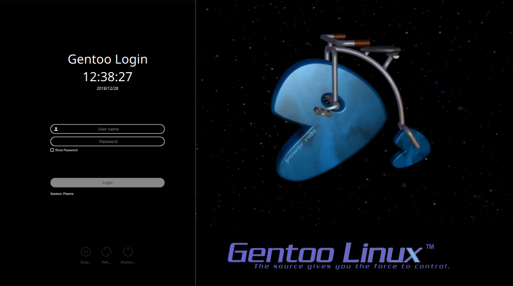
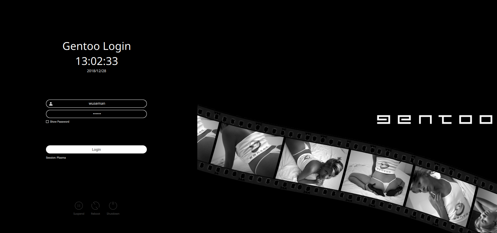

# WSPLASH

### A Login Theme Especially Created For Gentoo Linux






### Dependencies

[`sddm >= 0.18.0`](https://github.com/sddm/sddm), [`qt5 >= 5.11`](http://doc.qt.io/qt-5/index.html), & [`qt5-quickcontrols >= 5.11.2`](http://doc.qt.io/qt-5/qtquickcontrols2-index.html)

*Make sure these are up to date!*

### Installing the theme

###### From KDE Plasma

If you are on [KDE Plasma](https://www.kde.org/plasma-desktop)—by default [Gentoo](https://www.gentoo.org/), [Neon](https://neon.kde.org/), [Kubuntu](https://kubuntu.org/),
[KaOS](https://kaosx.us/) or [Chakra](https://www.chakralinux.org/) for example—you are lucky and can simply go to your system settings and under "Startup and Shutdown" followed by "Login Screen
(SDDM)" click "Get New Theme". From there search for "wsplash" and install.

If for some reason you cannot find the category named "Login Screen (SDDM)" in your system settings then you are missing `sddm-kcm`. Install this little helper with your package manager first. You will
be grateful you did.

###### From other desktop environments

[Download the tar archive from nr1.nu](https://nr1.nu/archive/wsplash-1.0.tar.gz) and extract the contents to the theme directory of SDDM *(change the path for the downloaded file if necessary)*:
```
$ sudo tar -xzvf ~/Downloads/wsplash-1.0.tar.gz -C /usr/share/sddm/themes
```
This will extract all the files to a folder called "wsplash" inside of the themes directory of SDDM.

After that you will have to point SDDM to the new theme by editing its config file, preferrably at `/etc/sddm.conf.d/sddm.conf` *(create if necessary)*. You can take the default config file of SDDM as
a reference: `/etc/sddm.conf/usr/lib/sddm/sddm.conf.d/sddm.conf`.

In the `[Theme]` section simply add the themes name: `Current=wsplash`. Also see the [Arch wiki on SDDM](https://wiki.archlinux.org/index.php/SDDM).

### Theming the theme

wsplash is extremely customizable by editing its included `theme.conf` file. You can change the colors and images used, the time and date formats, the appearance of the whole interface and even how 
it works. And as if that wouldn't still be enough you can translate every single button and label because SDDM is still lacking behind with localization and clearly [needs your
help](https://github.com/sddm/sddm/wiki/Localization)!

### Legal Notice

Copyright (C) 2018 Marian Arlt.

Sugar Dark is free software: you can redistribute it and/or modify it under the terms of the GNU General Public License as published by the Free Software Foundation, either version 3 of the License, or
(at your option) any later version.

Sugar Dark is distributed in the hope that it will be useful, but WITHOUT ANY WARRANTY; without even the implied warranty of MERCHANTABILITY or FITNESS FOR A PARTICULAR PURPOSE. See the GNU General
Public License for more details.

You should have received a copy of the GNU General Public License along with Sugar Dark. If not, see <https://www.gnu.org/licenses/>.


#### CONTACT

If you have problems, questions, ideas or suggestions please contact me: wuseman@nr1.nu (new email from 2018-11)

#### WEB SITE

Visit our homepage for the latest info and updated tools
https://github.com/wuseman && https://nr1.nu

#### END!
